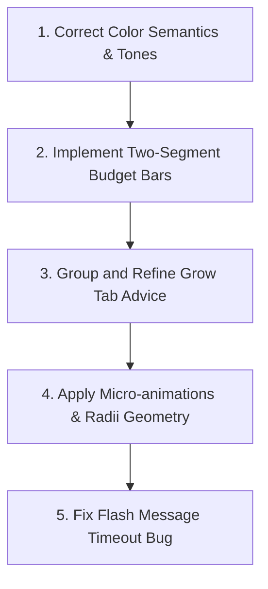

# Personal Finance Hub — Visual & Functional Review

This report assesses the current look, layout, UX, and functional flow of the Personal Finance Hub (`/finance`, implemented in [finance.tsx](file:///C:/Users/bskim/Dev/assistant/src/routes/finance.tsx)) based on the visual screenshots taken from localhost:3000. It highlights key visual discrepancies, UX shortcomings, and outlines a prioritized roadmap for bringing the page up to a premium, state-of-the-art visual standard.

## Tab Interface Walkthrough

```carousel

<!-- slide -->

<!-- slide -->

<!-- slide -->

<!-- slide -->

```

---

## Detailed Tab-by-Tab Analysis

### 1. Overview Tab

> [!NOTE]
> The Overview tab acts as the user's financial dashboard, summarizing current assets, liabilities, and monthly cash flow.

- **Look & Feel:** The dark theme matches the rest of the Compass app nicely. The three main stats cards (Cash Flow, Income, Known Outflow) look clean, but could feel more premium.
- **Layout & Usability:** The grouping of accounts by `CASH`, `CREDIT`, and `INVESTMENTS` is logical. However, the manual vs. synced badges can be visually distracting when repeated on every row.
- **Identified Improvements:**
  - **Cash Flow Sparkline:** Add a small visual sparkline/trend next to the Net Worth and Cash Flow stats.
  - **Inline Editing Visuals:** The edit/delete icons for accounts are tiny. The layout when inline editing is active is a bit cramped (`finance.tsx:475`).
  - **Account Types:** Standardize the badges or make the type indicators less noisy.

### 2. Budget Tab (50/30/20)

> [!WARNING]
> The Budget tab has several visual discrepancies where color indicators and layout configurations mismatch.

- **Progress Bars:** The Needs bar (currently near target) is amber, and the Wants bar (under budget) is green. However, Savings (which has $0 actual) is completely blank with no bar or placeholder.
- **Identified Improvements:**
  - **Two-Segment Budget Bars:** Update the bars (`finance.tsx:3653`) to show statement actuals as a solid color, and the expected/planned recurring amount as a striped or semi-translucent segment. This will visually distinguish "what has already cleared" from "what is planned."
  - **Color Semantics:** Needs shouldn't turn amber just because it is active. Color should reflect status (e.g., green if on track, amber if approaching threshold, red if over).
  - **Empty Savings Bar:** Render the savings target bar as a faint dotted or grey background with the target tick marker visible, rather than leaving it completely blank.
  - **Inline Take-home:** Move the monthly take-home card (which takes up a lot of space at the top) into the "Month vs plan" card header as a smaller inline editable element (e.g., `of $11,319 take-home ✎`).

### 3. Recurring Tab

> [!IMPORTANT]
> The Monthly Payment Check checklist is highly functional, but suffers from inverted status colors.

- **Color Inversion:** Subscriptions costing $353 renders in red (signaling danger, even though this is a standard category total), while Recurring Savings at $0 renders in success-green. This is actively misleading.
- **Identified Improvements:**
  - **Status Tone Correction:** Neutralize the stat colors for general category totals (`finance.tsx:2801`). Apply color selectively only if the status requires attention (e.g., $0 savings gets an amber warning).
  - **Payment Check Subtotal:** "1 of 14 seen" is helpful, but adding the dollar value of the pending bills (e.g., `≈$4,300 still to post`) next to the progress bar will assist with weekly cash planning.
  - **Visual Grouping:** Faintly separate matching (paid) items from unmatched items in the checklist instead of showing them as one flat list.

### 4. Investments Tab

- **Look & Feel:** The holdings table is clean, but the allocation bar is barely visible.
- **Identified Improvements:**
  - **Visual Anchor:** Allocation bars are styled as `h-1 w-12` with low opacity (`finance.tsx:3193`). They should be the visual anchor of the concentration table (e.g., full-width light background bars behind the text).
  - **Header Alignment:** In the screenshot, the "Refresh prices" button wraps onto a second line underneath the title, breaking the horizontal flex layout. Ensure this fits on one line or wraps cleanly on mobile viewports.
  - **More Data Columns:** Introduce cost basis or day-change indicators if available.

### 5. Grow Tab

- **Look & Feel:** The advice cards are too large and repetitive. The three static cards (Primary income, Consulting offer, Weekly pipeline) take up half the page, but the text never changes.
- **Identified Improvements:**
  - **Advice List Card:** Group all generated AI suggestions into a single divided card instead of rendering a separate full Card for each sentence (`finance.tsx:3325`).
  - **Selective Tasks:** Let users accept recommendations individually (e.g., a "→ Add to tasks" button on each row) rather than a global "Add all to tasks."
  - **Static Cards:** Collapse the static advice options or make them trackable (checkboxes for "done this week").
  - **Typography:** Bold or highlight numeric suggestions within cards (e.g., **Jeep loan**, **$1,094 payment**) to make them easier to scan.

---

## Technical Enhancements & Micro-interactions

Based on the [make-interfaces-feel-better](file:///C:/Users/bskim/Dev/assistant/.agents/skills/make-interfaces-feel-better/SKILL.md) guidelines:

1. **Transitions:** Replace `transition-all` on the progress bars and status badges with targeted transitions (e.g., `transition-[width] duration-300`).
2. **Touch Targets:** Increase hit areas on smaller components (like the "Need"/"Want" chips and row actions) to a minimum of `40x40px` (or use absolute pseudo-elements `after:w-10 after:h-10`).
3. **Press Scale:** Add a subtle press scale effect (e.g., `active:scale-[0.97] transition-all`) to the tab buttons and account filter chips.
4. **Concentric Radii:** Align border radius rules. The outer tab bar uses `rounded-lg` (8px) while inner pills use `rounded-md` (6px) with a `p-1` (4px) padding. The inner should use `rounded` (4px) for perfect geometry.
5. **Flash Message Bug:** The `flash` function (`finance.tsx:220`) triggers a timeout without clearing the old one. If multiple alerts trigger in quick succession, they cut each other off. Store the timeout in a React ref and clear it before starting a new one.

---

## Action Plan & Roadmap

Here is a recommended sequence to make the page significantly better and easier to manage:



> [!TIP]
> The first three items on this roadmap will immediately eliminate visual confusion and provide the highest return on usability.
